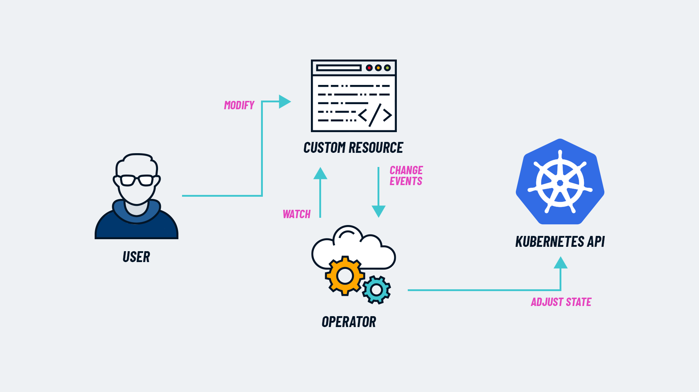

# CREATE CUSTOM OPERATOR & CRD


## Deployment Checker Operator (Namespaced Scoped)
Check and Reconcile app deployments. Create if not exists or Update image tag if outdated based on CRD Resource.

### CRD
```
apiVersion: apiextensions.k8s.io/v1
kind: CustomResourceDefinition
metadata:
  name: depcheckers.k8s.edcelvista.com
spec:
  group: k8s.edcelvista.com
  versions:
    - name: v1
      served: true
      storage: true
      schema:
        openAPIV3Schema:
          type: object
          properties:
            spec:
              type: object
              properties:
                image:
                  type: string
                replicas:
                  type: integer
                appSelector: 
                  type: string
  scope: Namespaced
  names:
    plural: depcheckers
    singular: depchecker
    kind: DepChecker
    shortNames:
    - dc
```
### CRD Resource
```
apiVersion: "k8s.edcelvista.com/v1"
kind: DepChecker
metadata:
  name: depchecker-resource
  namespace: 1024-custom-crd
spec:
  image: edcelvista/k8s-crd:0.0.2
  replicas: 1
  appSelector: depchecker-resource
```
**Note:** Controller scan, check and reconcile app deployments in demo and identify the deployments via label `appSelector: myapp-resource`
[Complete Flow Diagram](https://raw.githubusercontent.com/edcelvista/_golang-k8s-custom-operator/refs/heads/main/flow-diagram.draw.io.drawio)
### Cluster Role
```
apiVersion: rbac.authorization.k8s.io/v1
kind: ClusterRole
metadata:
  name: depcheckerclusterrole
rules:
- apiGroups: ["k8s.edcelvista.com"]
  resources: ["depcheckers"]
  verbs: ["get", "list", "watch"]
- apiGroups: ["apps"]
  resources: ["deployments"]
  verbs: ["create", "get", "update", "list", "watch", "delete"]
- apiGroups: [""]
  resources: ["nodes"]
  verbs: [ "get", "list", "watch"]
- apiGroups: ["apiextensions.k8s.io"]
  resources: ["customresourcedefinitions"]
  verbs: [ "get", "list", "watch"]
```
### Cluster Role Binding
```
apiVersion: rbac.authorization.k8s.io/v1
kind: ClusterRoleBinding
metadata:
  name: depcheckerclusterrole-binding
roleRef:
  apiGroup: rbac.authorization.k8s.io
  kind: ClusterRole
  name: depcheckerclusterrole
subjects:
  - kind: ServiceAccount
    name: depcheckerclusterrole-sa
    namespace: 1024-custom-crd
```
### Service Account
```
apiVersion: v1
kind: ServiceAccount
metadata:
  name: depcheckerclusterrole-sa
  namespace: 1024-custom-crd
```
### Operator
```
apiVersion: apps/v1
kind: Deployment
metadata:
  name: custom-operator
  labels:
    app: custom-operator
spec:
  selector:
    matchLabels:
      app: custom-operator
  replicas: 1
  strategy:
    rollingUpdate:
      maxSurge: 25%
      maxUnavailable: 25%
    type: RollingUpdate
  template:
    metadata:
      labels:
        app: custom-operator
    spec:
      serviceAccountName: depcheckerclusterrole-sa
      containers:
        - name: custom-operator
          image: edcelvista/ubuntu24-network-tools:53
          imagePullPolicy: Always
          command: ["custom-operator-deployment-recon-linux"]
          resources: 
            requests:
              cpu: 100m
              memory: 100Mi
            limits:
              cpu: 100m
              memory: 100Mi
          envFrom:
          - configMapRef:
              name: operator-cm
          volumeMounts:
          - name: localtime
            mountPath: /etc/localtime
      volumes:
        - name: localtime
          hostPath:
            path: /usr/share/zoneinfo/Asia/Shanghai
      restartPolicy: Always
---
kind: ConfigMap
apiVersion: v1
metadata:
  name: operator-cm
data:
  # CUSTOM_KUBE_CONFIG_PATH: "/opt/config/config"
  CRDNAME: "myapps.k8s.edcelvista.com"
  CRDGROUP: "k8s.edcelvista.com"
  CRDRESOURCE: "myapps"
  CRDVERSION: "v1"
  TARGETNAMESPACE: "demo"
  APPNAME: "demo-crd-resource"
  APPJSONTEMPLATE: "{ \"apiVersion\": \"apps/v1\", \"kind\": \"Deployment\", \"spec\": { \"selector\": { \"matchLabels\": {} }, \"template\": { \"spec\": { \"containers\": [ { \"command\": [ \"sleep\", \"infinity\" ], \"resources\": {}, \"terminationMessagePath\": \"/dev/termination-log\", \"terminationMessagePolicy\": \"File\", \"imagePullPolicy\": \"IfNotPresent\" } ], \"restartPolicy\": \"Always\", \"terminationGracePeriodSeconds\": 30, \"dnsPolicy\": \"ClusterFirst\", \"securityContext\": {}, \"schedulerName\": \"default-scheduler\" } }, \"strategy\": { \"type\": \"RollingUpdate\", \"rollingUpdate\": { \"maxUnavailable\": \"25%\", \"maxSurge\": \"25%\" } }, \"revisionHistoryLimit\": 10, \"progressDeadlineSeconds\": 600 } }"
  INVERVAL: "30"
```
**Note:** Operator controls and dictates the base app deployment structure.

---

## Secret Checker Operator (Cluster Scoped)
Check and Reconcile app secrets. Create if not exists or Update secret if outdated based on CRD Resource.

### CRD
```
apiVersion: apiextensions.k8s.io/v1
kind: CustomResourceDefinition
metadata:
  name: secretcheckers.k8s.edcelvista.com
spec:
  group: k8s.edcelvista.com
  versions:
    - name: v1
      served: true
      storage: true
      schema:
        openAPIV3Schema:
          type: object
          properties:
            spec:
              type: object
              properties:
                secret:
                  type: object
                  properties:
                    type:
                      type: string
                    name:
                      type: string
                    data:
                      type: object
                      description: Base64-encoded data entries like in Kubernetes Secrets.
                      additionalProperties:
                        type: object
                        properties:
                          tls.crt:
                            type: string
                            format: byte  # base64-encoded
                          tls.key:
                            type: string
                            format: byte  # base64-encoded
                    stringData:
                      type: object
                      description: Plaintext string data; will be base64-encoded into `data`
                      additionalProperties:
                        type: string
                  required: 
                    - data
  scope: Cluster
  names:
    plural: secretcheckers
    singular: secretchecker
    kind: SecretChecker
    shortNames:
    - sc
```
### CRD Resource
```
apiVersion: "k8s.edcelvista.com/v1"
kind: SecretChecker
metadata:
  name: secretchecker-resource
spec:
  secret:
    type: kubernetes.io/tls
    name: edcelvistadotcom-tls
    data:
      additionalProperties:
        tls.crt: LS0tLS
        tls.key: LS0tLS
```
### Cluster Role
```
apiVersion: rbac.authorization.k8s.io/v1
kind: ClusterRole
metadata:
  name: secretcheckerclusterrole
rules:
- apiGroups: ["k8s.edcelvista.com"]
  resources: ["secretcheckers"]
  verbs: ["get", "list", "watch"]
- apiGroups: [""]
  resources: ["secrets"]
  verbs: ["create", "get", "update", "list", "watch", "delete"]
- apiGroups: [""]
  resources: ["nodes"]
  verbs: [ "get", "list", "watch"]
- apiGroups: [""]
  resources: ["namespaces"]
  verbs: [ "get", "list", "watch"]
- apiGroups: ["apiextensions.k8s.io"]
  resources: ["customresourcedefinitions"]
  verbs: [ "get", "list", "watch"]
```
### Cluster Role Binding
```
apiVersion: rbac.authorization.k8s.io/v1
kind: ClusterRoleBinding
metadata:
  name: secretcheckerclusterrole-binding
roleRef:
  apiGroup: rbac.authorization.k8s.io
  kind: ClusterRole
  name: secretcheckerclusterrole
subjects:
  - kind: ServiceAccount
    name: secretcheckerclusterrole-sa
    namespace: 1024-custom-crd
```
### Service Account
```
apiVersion: v1
kind: ServiceAccount
metadata:
  name: secretcheckerclusterrole-sa
  namespace: 1024-custom-crd
```
### Operator
```
apiVersion: apps/v1
kind: Deployment
metadata:
  name: custom-operator
  labels:
    app: custom-operator
spec:
  selector:
    matchLabels:
      app: custom-operator
  replicas: 1
  strategy:
    rollingUpdate:
      maxSurge: 25%
      maxUnavailable: 25%
    type: RollingUpdate
  template:
    metadata:
      labels:
        app: custom-operator
    spec:
      serviceAccountName: secretcheckerclusterrole-sa
      containers:
        - name: custom-operator
          image: edcelvista/ubuntu24-network-tools:53
          imagePullPolicy: Always
          command: ["custom-operator-secret-recon-linux"]
          resources: 
            requests:
              cpu: 100m
              memory: 100Mi
            limits:
              cpu: 100m
              memory: 100Mi
          envFrom:
          - configMapRef:
              name: operator-cm
          volumeMounts:
          - name: localtime
            mountPath: /etc/localtime
      volumes:
        - name: localtime
          hostPath:
            path: /usr/share/zoneinfo/Asia/Shanghai
      restartPolicy: Always
---
kind: ConfigMap
apiVersion: v1
metadata:
  name: operator-cm
data:
  # CUSTOM_KUBE_CONFIG_PATH: "/opt/config/config"
  CRDNAME: "sectools.k8s.edcelvista.com"
  CRDGROUP: "k8s.edcelvista.com"
  CRDRESOURCE: "sectools"
  CRDVERSION: "v1"
  EXCLUDENAMESPACE: "argocd,castai-agent,custom-operator,default,krakend,kube-bench,kube-flannel,kube-node-lease,kube-public,kube-system,kyverno,monitoring,nginx-ingress"
  APPNAME: "edcelvistadotcom-aws-tls"
  INVERVAL: "30"
```
**Note:** Operator controls and dictates the what namespace to be excluded in secret injection.

---

# Admission Controller - Mutating & Validating
```
apiVersion: admissionregistration.k8s.io/v1
kind: ValidatingWebhookConfiguration
metadata:
  name: validating-always-allow
webhooks:
  - name: validating-always-allow.edcelvista.com
    rules:
      - apiGroups:
        - ''
        apiVersions:
        - 'v1'
        operations:
        - CREATE
        resources:
        - 'pods'
        scope: 'Namespaced'
    clientConfig:
      # url: https://webhook.custom-webhook.svc.cluster.local/webhook/validating/always-allow
      service:
        name: webhook
        namespace: custom-webhook
        path: "/webhook/validating/always-allow"
      caBundle: LS0tLS...
    admissionReviewVersions: ["v1"]
    sideEffects: None
    # failurePolicy: Ignore
    matchPolicy: Equivalent
    namespaceSelector: {}
    objectSelector:
      matchExpressions:
      - key: custom-webhook.edcelvista.com/validate-always-allow
        operator: Exists
    timeoutSeconds: 5
---
apiVersion: admissionregistration.k8s.io/v1
kind: MutatingWebhookConfiguration
metadata:
  name: mutating-always-allow
webhooks:
  - name: mutating-always-allow.edcelvista.com
    rules:
      - apiGroups:
        - ''
        apiVersions:
        - 'v1'
        operations:
        - CREATE
        resources:
        - 'pods'
        scope: 'Namespaced'
    clientConfig:
      service:
        name: webhook
        namespace: custom-webhook
        path: /webhook/mutating/always-allow
      caBundle: LS0tLS...
    admissionReviewVersions: ["v1"]
    sideEffects: None
    # failurePolicy: Ignore
    matchPolicy: Equivalent
    namespaceSelector: {}
    objectSelector:
      matchExpressions:
      - key: custom-webhook.edcelvista.com/mutate-always-allow
        operator: Exists
    timeoutSeconds: 5
```
### Webhook API
```
apiVersion: apps/v1
kind: Deployment
metadata:
  name: webhook-operator
  labels:
    app: webhook-operator
spec:
  selector:
    matchLabels:
      app: webhook-operator
  replicas: 1
  strategy:
    rollingUpdate:
      maxSurge: 25%
      maxUnavailable: 25%
    type: RollingUpdate
  template:
    metadata:
      labels:
        app: webhook-operator
    spec:
      containers:
        - name: webhook-operator
          image: edcelvista/ubuntu24-network-tools:53
          imagePullPolicy: Always
          command: ["webhook-linux"]
          resources: 
            requests:
              cpu: 100m
              memory: 100Mi
            limits:
              cpu: 100m
              memory: 100Mi
          envFrom:
          - configMapRef:
              name: webhook-cm
          ports:
          - name: webport
            containerPort: 8443
            protocol: TCP
          volumeMounts:
          - name: certs-volume
            mountPath: "/certs"
            readOnly: true
          - name: localtime
            mountPath: /etc/localtime
      volumes:
        - name: certs-volume
          secret:
            secretName: certs
        - name: localtime
          hostPath:
            path: /usr/share/zoneinfo/Asia/Shanghai
      restartPolicy: Always
---
kind: ConfigMap
apiVersion: v1
metadata:
  name: webhook-cm
data:
  PORT: ":8443"
  SSL_CERT: "/certs/tls.crt"
  SSL_KEY: "/certs/tls.key"
  VALIDATE_LABEL: "costCenter,tenantName,supportEmail"
  MUTATE_PATCH: "[{ \"op\": \"add\", \"path\": \"/metadata/labels/mutatedLabel\", \"value\": \"mutatedLabelValue\" }, { \"op\": \"add\", \"path\": \"/spec/containers/0/lifecycle\", \"value\": { \"postStart\": { \"exec\": { \"command\": [ \"/bin/sh\", \"-c\", \"curl -sk --location 'https://webhook.custom-webhook.svc:443/echo' --header 'Content-Type: application/json' --data '{ \\\"postStart\\\": \\\"$POD_NAMESPACE/$POD_NAME with $POD_IP\\\" }'\" ] } }, \"preStop\": { \"exec\": { \"command\": [ \"/bin/sh\", \"-c\", \"curl -sk --location 'https://webhook.custom-webhook.svc:443/echo' --header 'Content-Type: application/json' --data '{ \\\"preStop\\\": \\\"$POD_NAMESPACE/$POD_NAME with $POD_IP\\\" }'\" ] } } } }]"
  IS_DEBUG: "true"
---
apiVersion: v1
kind: Secret
metadata:
  name: certs
type: kubernetes.io/tls
data:
  tls.crt: LS0tLS...
  tls.key: LS0tLS...
---
apiVersion: v1
kind: Service
metadata:
  name: webhook
spec:
  ports:
    - name: webport
      protocol: TCP
      port: 443
      targetPort: 8443
  selector:
    app: webhook-operator
  type: ClusterIP
  sessionAffinity: None
  ipFamilies:
    - IPv4
  ipFamilyPolicy: SingleStack
  internalTrafficPolicy: Cluster
```
**Note:**  
Webhook handles the validate condition components for Validating ie. required labels and handles Mutating patch definition.
Webhook API [repo here](https://github.com/edcelvista/_golang-k8s-custom-operator/tree/main/webhook-admission-controller/app)

### Sample Request Payload - validating
```
{"kind":"AdmissionReview","apiVersion":"admission.k8s.io/v1","request":{"uid":"014ba691-7a1d-44e4-bd68-a11bca4d7751","kind":{"group":"capsule.clastix.io","version":"v1beta2","kind":"Tenant"},"resource":{"group":"capsule.clastix.io","version":"v1beta2","resource":"tenants"},"requestKind":{"group":"capsule.clastix.io","version":"v1beta2","kind":"Tenant"},"requestResource":{"group":"capsule.clastix.io","version":"v1beta2","resource":"tenants"},"name":"tenant-demo","operation":"UPDATE","userInfo":{"username":"system:serviceaccount:capsule-system:capsule","uid":"e09e2bc0-f069-4d03-b299-06a1c18af3c4","groups":["system:serviceaccounts","system:serviceaccounts:capsule-system","system:authenticated"],"extra":{"authentication.kubernetes.io/credential-id":["JTI=d74ce078-25fd-4eb7-9fda-65a21c8a81cd"],"authentication.kubernetes.io/node-name":["k8s-worker-aws"],"authentication.kubernetes.io/node-uid":["3b0664e3-46c4-44e8-b63d-80beccd53b14"],"authentication.kubernetes.io/pod-name":["capsule-controller-manager-58c7d76f49-5kdl6"],"authentication.kubernetes.io/pod-uid":["e0804b1c-73a1-47d7-bb78-e192f5fe3f74"]}},"object":{"apiVersion":"capsule.clastix.io/v1beta2","kind":"Tenant","metadata":{"creationTimestamp":"2025-05-12T09:58:33Z","generation":14,"labels":{"custom-webhook.edcelvista.com/tenant":"true","kubernetes.io/metadata.name":"tenant-demo"},"managedFields":[{"apiVersion":"capsule.clastix.io/v1beta2","fieldsType":"FieldsV1","fieldsV1":{"f:metadata":{"f:labels":{".":{},"f:kubernetes.io/metadata.name":{}}},"f:spec":{"f:ingressOptions":{".":{},"f:hostnameCollisionScope":{}},"f:limitRanges":{},"f:namespaceOptions":{"f:forbiddenAnnotations":{},"f:forbiddenLabels":{}},"f:networkPolicies":{},"f:resourceQuotas":{".":{},"f:scope":{}}}},"manager":"capsule","operation":"Update","time":"2025-05-12T09:58:33Z"},{"apiVersion":"capsule.clastix.io/v1beta2","fieldsType":"FieldsV1","fieldsV1":{"f:spec":{".":{},"f:cordoned":{},"f:namespaceOptions":{".":{},"f:quota":{}},"f:owners":{},"f:preventDeletion":{}}},"manager":"kubectl-create","operation":"Update","time":"2025-05-12T09:58:33Z"},{"apiVersion":"capsule.clastix.io/v1beta2","fieldsType":"FieldsV1","fieldsV1":{"f:status":{".":{},"f:namespaces":{},"f:size":{},"f:state":{}}},"manager":"capsule","operation":"Update","subresource":"status","time":"2025-05-12T09:59:33Z"},{"apiVersion":"capsule.clastix.io/v1beta2","fieldsType":"FieldsV1","fieldsV1":{"f:metadata":{"f:labels":{"f:custom-webhook.edcelvista.com/tenant":{}}},"f:spec":{"f:resourceQuotas":{"f:items":{}}}},"manager":"kubectl-edit","operation":"Update","time":"2025-06-02T13:20:32Z"}],"name":"tenant-demo","resourceVersion":"25471997","uid":"aa562080-861d-4e81-86ba-a4dbc8d684bb"},"spec":{"cordoned":false,"ingressOptions":{"hostnameCollisionScope":"Disabled"},"limitRanges":{},"namespaceOptions":{"forbiddenAnnotations":{},"forbiddenLabels":{},"quota":3},"networkPolicies":{},"owners":[{"clusterRoles":["admin","capsule-namespace-deleter"],"kind":"Group","name":"8fdcd0fc-94a6-4027-adff-7505703c5faf"}],"preventDeletion":false,"resourceQuotas":{"items":[{"hard":{"limits.cpu":"2","limits.memory":"2Gi","requests.cpu":"100m","requests.memory":"1Gi"}},{"hard":{"pods":"25"}}],"scope":"Tenant"}},"status":{"namespaces":["demo"],"size":1,"state":"Active"}},"oldObject":{"apiVersion":"capsule.clastix.io/v1beta2","kind":"Tenant","metadata":{"creationTimestamp":"2025-05-12T09:58:33Z","generation":14,"labels":{"custom-webhook.edcelvista.com/tenant":"true","kubernetes.io/metadata.name":"tenant-demo"},"managedFields":[{"apiVersion":"capsule.clastix.io/v1beta2","fieldsType":"FieldsV1","fieldsV1":{"f:metadata":{"f:labels":{".":{},"f:kubernetes.io/metadata.name":{}}},"f:spec":{"f:ingressOptions":{".":{},"f:hostnameCollisionScope":{}},"f:limitRanges":{},"f:namespaceOptions":{"f:forbiddenAnnotations":{},"f:forbiddenLabels":{}},"f:networkPolicies":{},"f:resourceQuotas":{".":{},"f:scope":{}}}},"manager":"capsule","operation":"Update","time":"2025-05-12T09:58:33Z"},{"apiVersion":"capsule.clastix.io/v1beta2","fieldsType":"FieldsV1","fieldsV1":{"f:spec":{".":{},"f:cordoned":{},"f:namespaceOptions":{".":{},"f:quota":{}},"f:owners":{},"f:preventDeletion":{}}},"manager":"kubectl-create","operation":"Update","time":"2025-05-12T09:58:33Z"},{"apiVersion":"capsule.clastix.io/v1beta2","fieldsType":"FieldsV1","fieldsV1":{"f:status":{".":{},"f:namespaces":{},"f:size":{},"f:state":{}}},"manager":"capsule","operation":"Update","subresource":"status","time":"2025-05-12T09:59:33Z"},{"apiVersion":"capsule.clastix.io/v1beta2","fieldsType":"FieldsV1","fieldsV1":{"f:metadata":{"f:labels":{"f:custom-webhook.edcelvista.com/tenant":{}}},"f:spec":{"f:resourceQuotas":{"f:items":{}}}},"manager":"kubectl-edit","operation":"Update","time":"2025-06-02T13:20:32Z"}],"name":"tenant-demo","resourceVersion":"25471997","uid":"aa562080-861d-4e81-86ba-a4dbc8d684bb"},"spec":{"cordoned":false,"ingressOptions":{"hostnameCollisionScope":"Disabled"},"limitRanges":{},"namespaceOptions":{"forbiddenAnnotations":{},"forbiddenLabels":{},"quota":3},"networkPolicies":{},"owners":[{"clusterRoles":["admin","capsule-namespace-deleter"],"kind":"Group","name":"8fdcd0fc-94a6-4027-adff-7505703c5faf"}],"preventDeletion":false,"resourceQuotas":{"items":[{"hard":{"limits.cpu":"2","limits.memory":"2Gi","requests.cpu":"100m","requests.memory":"1Gi"}},{"hard":{"pods":"25"}}],"scope":"Tenant"}},"status":{"namespaces":["demo"],"size":1,"state":"Active"}},"dryRun":false,"options":{"kind":"UpdateOptions","apiVersion":"meta.k8s.io/v1"}}}
```

```
{"kind":"AdmissionReview","apiVersion":"admission.k8s.io/v1","request":{"uid":"cb2373d5-7933-43a4-9ca7-0be7db7c6f33","kind":{"group":"","version":"v1","kind":"Pod"},"resource":{"group":"","version":"v1","resource":"pods"},"requestKind":{"group":"","version":"v1","kind":"Pod"},"requestResource":{"group":"","version":"v1","resource":"pods"},"name":"demo-crd-resource-76bf5f8695-sf4bt","namespace":"demo","operation":"CREATE","userInfo":{"username":"system:serviceaccount:kube-system:replicaset-controller","uid":"50211333-a14e-4c1a-9c38-e00d5b1af517","groups":["system:serviceaccounts","system:serviceaccounts:kube-system","system:authenticated"],"extra":{"authentication.kubernetes.io/credential-id":["JTI=7edabfc3-6128-44f4-8d8e-bc35d1ccd47d"]}},"object":{"kind":"Pod","apiVersion":"v1","metadata":{"name":"demo-crd-resource-76bf5f8695-sf4bt","generateName":"demo-crd-resource-76bf5f8695-","namespace":"demo","uid":"7df01e81-bb71-49d5-a36b-74de72836d75","creationTimestamp":"2025-04-29T04:39:35Z","labels":{"appSelector":"myapp-resource","costCenter":"test","custom-webhook.edcelvista.com/validate-always-allow":"true","pod-template-hash":"76bf5f8695","supportEmail":"administrator_edcelvista.com","tenantName":"test"},"annotations":{"kubectl.kubernetes.io/restartedAt":"2025-04-29T04:39:32Z"},"ownerReferences":[{"apiVersion":"apps/v1","kind":"ReplicaSet","name":"demo-crd-resource-76bf5f8695","uid":"ee15fb57-668f-4d47-b710-29e8c37fbc7b","controller":true,"blockOwnerDeletion":true}],"managedFields":[{"manager":"kube-controller-manager","operation":"Update","apiVersion":"v1","time":"2025-04-29T04:39:35Z","fieldsType":"FieldsV1","fieldsV1":{"f:metadata":{"f:annotations":{".":{},"f:kubectl.kubernetes.io/restartedAt":{}},"f:generateName":{},"f:labels":{".":{},"f:appSelector":{},"f:costCenter":{},"f:custom-webhook.edcelvista.com/validate-always-allow":{},"f:pod-template-hash":{},"f:supportEmail":{},"f:tenantName":{}},"f:ownerReferences":{".":{},"k:{\"uid\":\"ee15fb57-668f-4d47-b710-29e8c37fbc7b\"}":{}}},"f:spec":{"f:containers":{"k:{\"name\":\"demo-crd-resource\"}":{".":{},"f:command":{},"f:image":{},"f:imagePullPolicy":{},"f:name":{},"f:resources":{},"f:terminationMessagePath":{},"f:terminationMessagePolicy":{}}},"f:dnsPolicy":{},"f:enableServiceLinks":{},"f:restartPolicy":{},"f:schedulerName":{},"f:securityContext":{},"f:terminationGracePeriodSeconds":{}}}}]},"spec":{"volumes":[{"name":"kube-api-access-5drvz","projected":{"sources":[{"serviceAccountToken":{"expirationSeconds":3607,"path":"token"}},{"configMap":{"name":"kube-root-ca.crt","items":[{"key":"ca.crt","path":"ca.crt"}]}},{"downwardAPI":{"items":[{"path":"namespace","fieldRef":{"apiVersion":"v1","fieldPath":"metadata.namespace"}}]}}],"defaultMode":420}}],"containers":[{"name":"demo-crd-resource","image":"edcelvista/ubuntu24-network-tools:v13-k8s-crd","command":["sleep","infinity"],"resources":{},"volumeMounts":[{"name":"kube-api-access-5drvz","readOnly":true,"mountPath":"/var/run/secrets/kubernetes.io/serviceaccount"}],"terminationMessagePath":"/dev/termination-log","terminationMessagePolicy":"File","imagePullPolicy":"IfNotPresent"}],"restartPolicy":"Always","terminationGracePeriodSeconds":30,"dnsPolicy":"ClusterFirst","serviceAccountName":"default","serviceAccount":"default","securityContext":{},"schedulerName":"default-scheduler","tolerations":[{"key":"node.kubernetes.io/not-ready","operator":"Exists","effect":"NoExecute","tolerationSeconds":300},{"key":"node.kubernetes.io/unreachable","operator":"Exists","effect":"NoExecute","tolerationSeconds":300}],"priority":0,"enableServiceLinks":true,"preemptionPolicy":"PreemptLowerPriority"},"status":{"phase":"Pending","qosClass":"BestEffort"}},"oldObject":null,"dryRun":false,"options":{"kind":"CreateOptions","apiVersion":"meta.k8s.io/v1"}}}
```

### Sample Request Payload - mutating
```
{"kind":"AdmissionReview","apiVersion":"admission.k8s.io/v1","request":{"uid":"cb2373d5-7933-43a4-9ca7-0be7db7c6f33","kind":{"group":"","version":"v1","kind":"Pod"},"resource":{"group":"","version":"v1","resource":"pods"},"requestKind":{"group":"","version":"v1","kind":"Pod"},"requestResource":{"group":"","version":"v1","resource":"pods"},"name":"demo-crd-resource-76bf5f8695-sf4bt","namespace":"demo","operation":"CREATE","userInfo":{"username":"system:serviceaccount:kube-system:replicaset-controller","uid":"50211333-a14e-4c1a-9c38-e00d5b1af517","groups":["system:serviceaccounts","system:serviceaccounts:kube-system","system:authenticated"],"extra":{"authentication.kubernetes.io/credential-id":["JTI=7edabfc3-6128-44f4-8d8e-bc35d1ccd47d"]}},"object":{"kind":"Pod","apiVersion":"v1","metadata":{"name":"demo-crd-resource-76bf5f8695-sf4bt","generateName":"demo-crd-resource-76bf5f8695-","namespace":"demo","uid":"7df01e81-bb71-49d5-a36b-74de72836d75","creationTimestamp":"2025-04-29T04:39:35Z","labels":{"appSelector":"myapp-resource","costCenter":"test","custom-webhook.edcelvista.com/validate-always-allow":"true","pod-template-hash":"76bf5f8695","supportEmail":"administrator_edcelvista.com","tenantName":"test"},"annotations":{"kubectl.kubernetes.io/restartedAt":"2025-04-29T04:39:32Z"},"ownerReferences":[{"apiVersion":"apps/v1","kind":"ReplicaSet","name":"demo-crd-resource-76bf5f8695","uid":"ee15fb57-668f-4d47-b710-29e8c37fbc7b","controller":true,"blockOwnerDeletion":true}],"managedFields":[{"manager":"kube-controller-manager","operation":"Update","apiVersion":"v1","time":"2025-04-29T04:39:35Z","fieldsType":"FieldsV1","fieldsV1":{"f:metadata":{"f:annotations":{".":{},"f:kubectl.kubernetes.io/restartedAt":{}},"f:generateName":{},"f:labels":{".":{},"f:appSelector":{},"f:costCenter":{},"f:custom-webhook.edcelvista.com/validate-always-allow":{},"f:pod-template-hash":{},"f:supportEmail":{},"f:tenantName":{}},"f:ownerReferences":{".":{},"k:{\"uid\":\"ee15fb57-668f-4d47-b710-29e8c37fbc7b\"}":{}}},"f:spec":{"f:containers":{"k:{\"name\":\"demo-crd-resource\"}":{".":{},"f:command":{},"f:image":{},"f:imagePullPolicy":{},"f:name":{},"f:resources":{},"f:terminationMessagePath":{},"f:terminationMessagePolicy":{}}},"f:dnsPolicy":{},"f:enableServiceLinks":{},"f:restartPolicy":{},"f:schedulerName":{},"f:securityContext":{},"f:terminationGracePeriodSeconds":{}}}}]},"spec":{"volumes":[{"name":"kube-api-access-5drvz","projected":{"sources":[{"serviceAccountToken":{"expirationSeconds":3607,"path":"token"}},{"configMap":{"name":"kube-root-ca.crt","items":[{"key":"ca.crt","path":"ca.crt"}]}},{"downwardAPI":{"items":[{"path":"namespace","fieldRef":{"apiVersion":"v1","fieldPath":"metadata.namespace"}}]}}],"defaultMode":420}}],"containers":[{"name":"demo-crd-resource","image":"edcelvista/ubuntu24-network-tools:v13-k8s-crd","command":["sleep","infinity"],"resources":{},"volumeMounts":[{"name":"kube-api-access-5drvz","readOnly":true,"mountPath":"/var/run/secrets/kubernetes.io/serviceaccount"}],"terminationMessagePath":"/dev/termination-log","terminationMessagePolicy":"File","imagePullPolicy":"IfNotPresent"}],"restartPolicy":"Always","terminationGracePeriodSeconds":30,"dnsPolicy":"ClusterFirst","serviceAccountName":"default","serviceAccount":"default","securityContext":{},"schedulerName":"default-scheduler","tolerations":[{"key":"node.kubernetes.io/not-ready","operator":"Exists","effect":"NoExecute","tolerationSeconds":300},{"key":"node.kubernetes.io/unreachable","operator":"Exists","effect":"NoExecute","tolerationSeconds":300}],"priority":0,"enableServiceLinks":true,"preemptionPolicy":"PreemptLowerPriority"},"status":{"phase":"Pending","qosClass":"BestEffort"}},"oldObject":null,"dryRun":false,"options":{"kind":"CreateOptions","apiVersion":"meta.k8s.io/v1"}}}
```